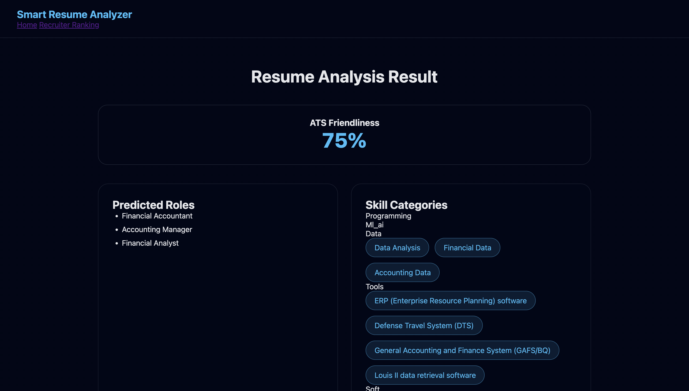
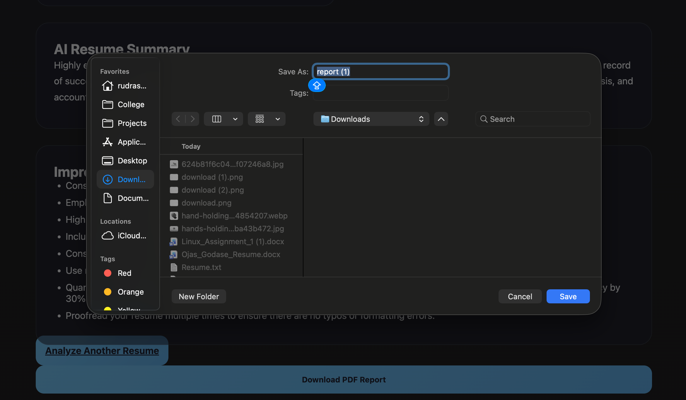

# 🧠 Smart Resume Analyzer

Smart Resume Analyzer is an AI-powered resume evaluation and recruiter ranking platform that analyzes resumes using large language models and NLP techniques.  
The system provides intelligent feedback for job seekers and automated candidate ranking for recruiters using ATS-style scoring.

---

## 🚀 Features

### 👤 Job Seeker Mode
- ATS friendliness score
- AI resume summary
- Resume improvement suggestions
- Skill extraction
- Skill categorization
- Predicted job roles
- Experience extraction
- Downloadable PDF report

### 🧑‍💼 Recruiter Mode
- Resume vs Job Description skill match %
- ATS alignment scoring
- Role relevance detection
- Experience scoring
- Multi-resume ranking
- Candidate comparison table

---

## 📸 Application Screenshots

### Job Seeker Analysis


### Job Seeker Results


### Recruiter Ranking


### PDF Report Download


## 🧠 AI / NLP Components

- Llama-3 (Groq API) → structured resume intelligence
- SBERT → semantic skill extraction
- Custom ATS engine → resume scoring
- NLP parsing → experience & role extraction

---

## 📊 Recruiter Ranking Formula

Final Score =  
0.4 × ATS  
+ 0.4 × Skill Match  
+ 0.1 × Role Match  
+ 0.1 × Experience Score  

---

## 📁 Project Structure

```
smart-resume-analyzer/
│
├── app.py
├── requirements.txt
├── .env.example
├── data/
│ └── skills.txt
│
├── utils/
│ ├── resume_parser.py
│ ├── skill_extractor.py
│ ├── ats_score.py
│ └── pdf_report.py
│
├── templates/
│ ├── index.html
│ ├── result.html
│ ├── ranking.html
│ └── layout.html
│
├── static/
│ ├── css/styles.css
│ └── js/animations.js
│
└── README.md
```

---

## ⚙️ Installation

```bash
git clone https://github.com/RudraShekhare/smart-resume-analyzer.git
cd smart-resume-analyzer
pip install -r requirements.txt
```

---

**🔑 Environment Setup**

Create a .env file in the project root:

GROQ_API_KEY=your_api_key_here

---

**▶️ Run the Application**
python app.py

Open in browser:

http://127.0.0.1:5000
📄 PDF Report

-> Users can download a resume analysis report containing:

  -ATS score
  -Skill match
  -Predicted roles
  -Summary
  -Suggestions
  
---

**🎯 Use Cases**

- Resume optimization for students

- Recruiter candidate screening

- Campus placement filtering

- Hiring automation

- Career guidance tools

**👤 Author**

**Rudra Shekhare**
@Computer Engineering - viit,pune.
AI / ML Engineer
Pune, India**

---

## ✅ How to use

1. Replace your `README.md` with this
2. Save
3. Run:

```bash
git add README.md
git commit -m "Update README"
git push
```

